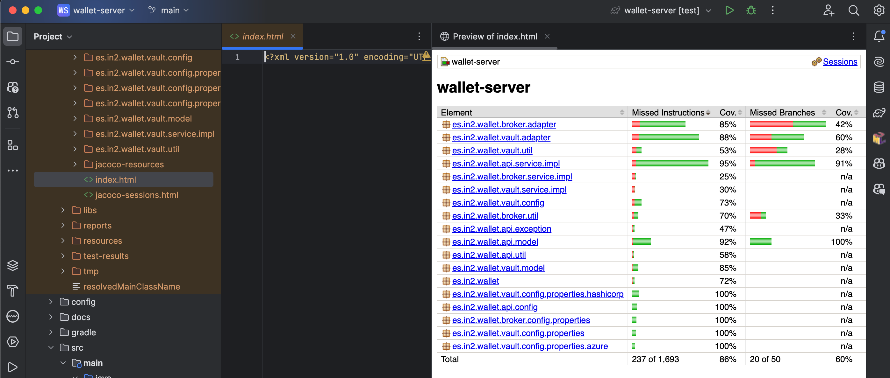

# Implementando JaCoCo
_24/02/2024 - v1.0.0 - Oriol Canadés_

## Introducción

La cobertura de código (coverage) es una métrica esencial que nos ayuda a entender qué parte de nuestro código fuente está siendo ejecutado por nuestros tests. JaCoCo (Java Code Coverage Library) es una popular herramienta que genera informes de cobertura en proyectos Java. En esta entrada, te mostraré cómo integrar JaCoCo en un proyecto Spring Boot, utilizando tanto Maven como Gradle, así como cómo ejecutar tests y visualizar el informe de cobertura.

## Usando Maven

1. **Configurar el Plugin de JaCoCo**: para integrar JaCoCo con Maven, necesitas configurar el plugin de JaCoCo en tu archivo pom.xml. Agrega el siguiente snippet dentro de la sección <build>:
    
    ```xml
    <build>
      <plugins>
        <plugin>
          <groupId>org.jacoco</groupId>
          <artifactId>jacoco-maven-plugin</artifactId>
          <version>0.8.7</version> <!-- Usa la última versión disponible --> 
          <executions>
            <execution>
              <goals>
                <goal>prepare-agent</goal>
              </goals> 
            </execution> <!-- Esta ejecución genera el reporte de cobertura --> 
            <execution> 
              <id>report</id> 
              <phase>test</phase> 
              <goals>
                <goal>report</goal>
              </goals> 
            </execution> 
          </executions>
        </plugin>
      </plugins>
    </build>
    ```
2. Ejecutar Tests y Generar el Informe
Para ejecutar los tests y generar el informe de cobertura, utiliza el siguiente comando Maven:

    ```bash
    mvn clean test
    ```

Tras la ejecución, el informe de JaCoCo estará disponible en target/site/jacoco/index.html.

## Usando Gradle

1. **Aplicar el Plugin de JaCoCo**: para proyectos Gradle, primero necesitas aplicar el plugin de JaCoCo. Añade lo siguiente a tu archivo build.gradle:

    ```groovy
    plugins {
        id 'java' id 'org.springframework.boot' version '2.5.6' id 'jacoco'
    }
    
    jacoco {
        toolVersion = "0.8.7" // Usa la última versión disponible
    }
    
    tasks.named('test') {
        useJUnitPlatform()
        // crea el reporte después de ejecutar los tests
        finalizedBy(tasks.jacocoTestReport)
    }
    
    tasks.jacocoTestReport {
        dependsOn(tasks.test)
        reports {
            xml.required.set(true)
            csv.required.set(false)
            html.outputLocation.set(layout.buildDirectory.dir('jacocoHtml'))
        }
        afterEvaluate {
            classDirectories.setFrom(files(classDirectories.files.collect {
                fileTree(dir: it, exclude: [
                    'src/main/java/es/in2/wallet/WalletServerApplication.java'
                ])
            }))
        }
    }
    ```

2. Ejecutar Tests y Generar el Informe
Para ejecutar los tests y generar el informe de cobertura con Gradle, usa el siguiente comando:

    ```bash
    ./gradlew test jacocoTestReport
    ```

Después de la ejecución, puedes encontrar el informe de JaCoCo en build/jacocoHtml/index.html.

## Visualizando el Informe

Independientemente de si estás utilizando Maven o Gradle, una vez generado el informe, puedes abrir el archivo index.html en cualquier navegador web para visualizar la cobertura de código de tu proyecto. Este informe te proporcionará detalles sobre la cobertura de clases, métodos y líneas de código, permitiéndote identificar las áreas de tu código que pueden necesitar más pruebas.


 

