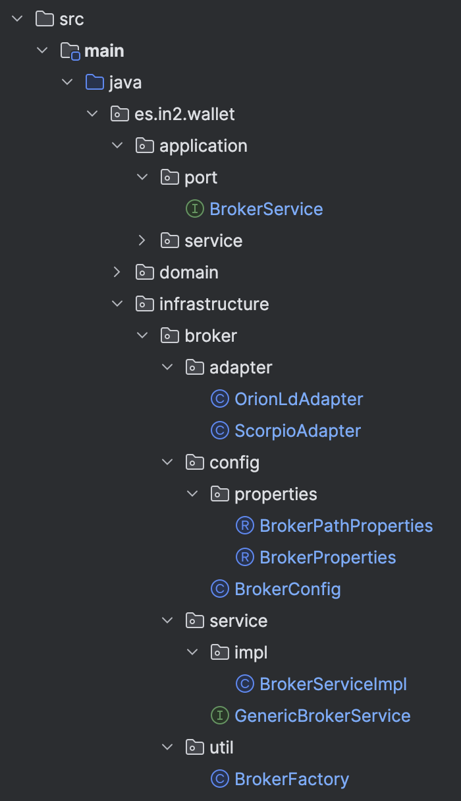

# Implementación de Arquitectura Hexagonal para Integración Flexible de Proveedores de Soluciones - Caso de uso: Adaptadores de Context Broker

## Introducción

Queremos añadir una estructura abstracta que soporte varios proveedores de un Context Broker. Para ello, vamos a utilizar la arquitectura hexagonal o de puertos y adaptadores. La idea es que la capa de aplicación pueda invocar un servicio genérico que se encargue de interactuar con el broker concreto. La capa de infraestructura se encargará de implementar los adaptadores específicos para cada proveedor de servicios de broker. 

Vamos a ver cómo estructuraríamos el proyecto para soportar esta funcionalidad.

Vista general de la estructura del proyecto:


### application
#### /port:
- **Service (Interfaz)**: Define los contratos para los casos de uso de la aplicación, sin preocuparse por los detalles de implementación. Son los métodos que el núcleo de la aplicación puede invocar y que se espera que la capa de infraestructura implemente.

```java
package es.in2.wallet.application.port;

public interface BrokerService {
    Mono<Void> postEntity(String processId, String requestBody);
    Mono<Optional<String>>  getEntityById(String processId, String userId);
    Mono<Void> updateEntity(String processId,  String userId, String requestBody);
}
```

### domain
Aquí es donde se ubicarían tus entidades, valor objetos, lógica de negocio y excepciones del dominio.

```java
package es.in2.wallet.domain.service.impl;

@Slf4j
@Service
@RequiredArgsConstructor
public class PresentationServiceImpl implements PresentationService {

    private final ObjectMapper objectMapper;
    private final UserDataService userDataService;
    private final BrokerService brokerService;
    private final SignerService signerService;

    private Mono<String> createSignedVerifiablePresentation(String processId, String authorizationToken, 
                                                            String nonce, String audience, 
                                                            List<CredentialsBasicInfo> selectedVcList, 
                                                            String format) {
        return getUserIdFromToken(authorizationToken)
                .flatMap(userId -> brokerService.getEntityById(processId, userId));
    }
    
}
```

### infrastructure
#### broker/service:
- **GenericService (Interfaz)**: Representa una abstracción general para los servicios que interactúan con diferentes brokers. Define una API que todos los adaptadores específicos de brokers deben implementar.

```java
package es.in2.wallet.infrastructure.broker.service;

public interface GenericBrokerService {
    Mono<Void> postEntity(String processId, String requestBody);
    Mono<Optional<String>>  getEntityById(String processId, String  userId);
    Mono<Void> updateEntity(String processId,  String  userId, String requestBody);
}
```

#### /service/impl:
- **ServiceImpl**: Contiene la implementación concreta de la interfaz Service. Utiliza un factory para establecer el adaptador adecuado basándose en la configuración y luego delega las llamadas a ese adaptador.

```java
package es.in2.wallet.infrastructure.broker.service.impl;

@Service
public class BrokerServiceImpl implements BrokerService {

    private final GenericBrokerService brokerAdapter;

    public BrokerServiceImpl(BrokerFactory brokerFactory) {
        this.brokerAdapter = brokerFactory.getBrokerAdapter();
    }

    public Mono<Void> postEntity(String processId, String requestBody) {
        return brokerAdapter.postEntity(processId, requestBody);
    }

    public Mono<Optional<String>>  getEntityById(String processId, String userId) {
        return brokerAdapter.getEntityById(processId, userId);
    }

    public Mono<Void> updateEntity(String processId, String userId, String requestBody) {
        return brokerAdapter.updateEntity(processId, userId, requestBody);
    }
    
}
```

#### /adapter:
- **Adapters**: Implementaciones concretas de la interfaz GenericService. Cada adaptador es específico para un proveedor de servicios de broker y sobrescribe los métodos definidos en GenericService.

```java
package es.in2.wallet.infrastructure.broker.adapter;

@Slf4j
@Component
@RequiredArgsConstructor
public class ScorpioAdapter implements GenericBrokerService {

    private final ObjectMapper objectMapper;
    private final BrokerConfig brokerConfig;
    private WebClient webClient;

    @PostConstruct
    public void init() {
        this.webClient = ApplicationUtils.WEB_CLIENT;
    }

    @Override
    public Mono<Void> postEntity(String processId, String requestBody) {
        MediaType mediaType = getContentTypeAndAcceptMediaType(requestBody);
        return webClient.post()
                .uri(brokerConfig.getExternalUrl() + brokerConfig.getPathEntities())
                .accept(mediaType)
                .contentType(mediaType)
                .bodyValue(requestBody)
                .retrieve()
                .bodyToMono(Void.class)
                .doOnSuccess(v -> log.debug("Entity saved"))
                .doOnError(e -> log.debug("Error saving entity"))
                .onErrorResume(Exception.class, Mono::error);
    }

    @Override
    public Mono<Optional<String>> getEntityById(String processId, String userId) {
        // add code here
    }
    
    @Override
    public Mono<Void> updateEntity(String processId, String userId, String requestBody) {
        // add code here
    }

}
```

#### /config:
- **Properties**: Clases que representan la configuración específica que se mapea desde los archivos de configuración (como YAML).
- **Config**: Clases que utilizan las Properties para configurar y exponer beans específicos de Spring que serán utilizados por la aplicación, como la configuración de los adaptadores de brokers.

#### /util:
- **Factory**: Implementa la lógica para seleccionar y construir una instancia del adaptador de broker apropiado basándose en la configuración o parámetros proporcionados.

```java
package es.in2.wallet.infrastructure.broker.util;

@Component
@RequiredArgsConstructor
public class BrokerFactory {

    private final BrokerConfig brokerConfig;
    private final ScorpioAdapter scorpioAdapter;
    private final OrionLdAdapter orionLdAdapter;

    public GenericBrokerService getBrokerAdapter() {
        return switch (brokerConfig.getProvider()) {
            case "scorpio" -> scorpioAdapter;
            case "orion-ld" -> orionLdAdapter;
            default -> throw new IllegalArgumentException("Invalid Context Broker provider: " + brokerConfig.getProvider());
        };
    }

}
```
